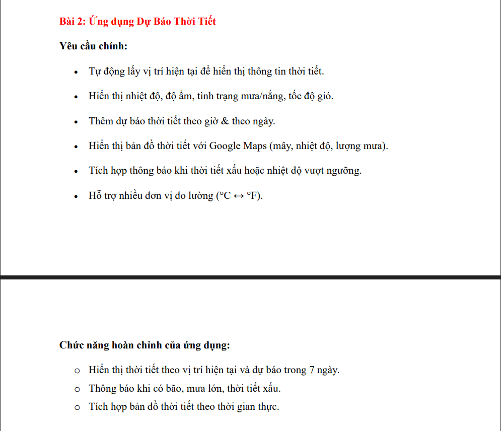

# Things todo

Requirement: 
- [X] Auto fetch current weather location
- [X] Show detail weather broadcast
  - [X] Temperature
  - [X] Humidity
  - [X] Wind Speed
  - [X] Rain
  - [X] Description
- [ ] Add hourly and daily weather broadcast
  - [ ] **Step 1: API Update** - Modify `WeatherService.java` to include the `forecast` endpoint for 5-day/3-hour data.
  - [ ] **Step 2: Model Expansion** - Create `ForecastResponse` and `ForecastItem` models to parse the list of weather predictions.
  - [ ] **Step 3: Repository Enhancement** - Add a `fetchForecast` method in `WeatherRepository.java`.
  - [ ] **Step 4: Layout Design** - Create a new layout file (e.g., `item_forecast.xml`) and add a `RecyclerView` to `activity_main.xml`.
  - [ ] **Step 5: Adapter Implementation** - Create a `ForecastAdapter` to display the list of weather data.
  - [ ] **Step 6: UI Integration** - Update `MainActivity.java` to fetch forecast data and populate the `RecyclerView`.
- [ ] Show weather broadcast in Google Maps (Cloud, Temperature, Rain)
- [ ] Implement notification for bad weather and temperature limit
- [ ] Support unit conversion for Celsius and Fahrenheit

Feature Goal:
- [ ] Show weather in current location and broadcast in 7 days
- [ ] Notify hurricane, storm and bad weather
- [ ] Implement weather map in realtime

